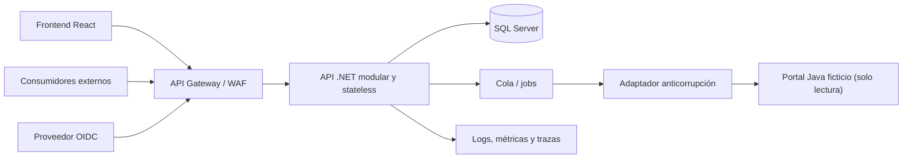

# Caso logístico: propuesta técnica

## Recomendación

Recomiendo comenzar con un monolito modular .NET y un frontend React desplegados de forma independiente, con SQL Server como almacenamiento transaccional. No usaría microservicios solo por un volumen de 10.000 incidencias diarias; definiría límites internos claros para extraer módulos únicamente cuando las métricas o la organización lo justifiquen.

## Capas y módulos .NET

- API: controllers, autenticación, autorización, versionado, middleware y composición.
- Application: casos de uso, DTO, validación de aplicación y puertos.
- Domain: incidencias, asignaciones, transiciones e invariantes sin dependencias externas.
- Infrastructure: EF Core, SQL Server, auditoría, identidad e implementación de integraciones.
- Módulos funcionales: incidencias, asignación, identidad/autorización, auditoría e integración legado.

## Módulos frontend

- `core`: cliente HTTP, sesión, trazabilidad y manejo central de errores.
- `features/incidents`: listado, detalle, creación, asignación e historial.
- `components`: controles y estados visuales reutilizables y accesibles.
- `app`: rutas, store y políticas globales.

Separaría estado remoto, estado de sesión y estado efímero de formularios. Mantendría filtros y paginación en la URL para permitir enlaces reproducibles.

## Persistencia y auditoría

Usaría SQL Server para incidencias normalizadas, asignaciones y catálogos. Guardaría `AuditEvents` como registros append-only con entidad, tipo de evento, actor, timestamp UTC, correlation ID y un payload limitado. El cambio funcional y su auditoría se confirmarían en la misma transacción. Restringiría permisos de actualización y eliminación, y acordaría retención con negocio y legal.

## Integración con el legado Java

El portal Java indicado en el ejercicio es ficticio y no se proporcionó estructura para interpretar. Antes de construir la integración realizaría un spike para identificar tecnología, módulos, modelo, autenticación y contratos disponibles. Preferiría una API estable de solo lectura. Si no existe, usaría el mecanismo autorizado —por ejemplo réplica o export batch— detrás de un adaptador anticorrupción.

Aplicaría timeout, circuit breaker y backoff. Si el consumo fuera asíncrono, los snapshots serían idempotentes y la interfaz mostraría su fecha de actualización. Esta estrategia evita acoplar el nuevo dominio a clases o tablas inventadas del sistema legado.

## Seguridad y errores

Usaría OIDC/OAuth 2.0, JWT de corta duración, scopes por consumidor y políticas por rol y ámbito. El gateway aplicaría TLS, cuotas y límites. Validaría inputs en servidor, respondería Problem Details sin internals y mantendría secretos en un vault. Toda operación sensible quedaría auditada.

## Observabilidad

Propagaría trace y correlation ID por HTTP, jobs y adaptadores. Mediría latencia y errores por endpoint, profundidad de cola, edad de sincronización, fallos del legado y transiciones. Separaría liveness de readiness y asociaría las alertas a runbooks.

## Escalabilidad, despliegue y trade-offs

La API stateless puede escalar horizontalmente; la paginación y los índices protegen SQL Server. Movería tareas largas a jobs solo cuando exista una necesidad medida. Usaría despliegues graduales, migraciones compatibles hacia atrás, backups verificados y rollback de aplicación.

El monolito reduce costo y complejidad operacional, pero exige disciplina modular. SQL Server facilita consistencia y tooling, con costo de licenciamiento a evaluar. Una integración asíncrona mejora resiliencia, aunque introduce consistencia eventual cuya frescura debe acordarse.
