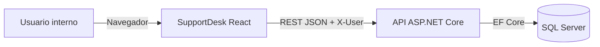
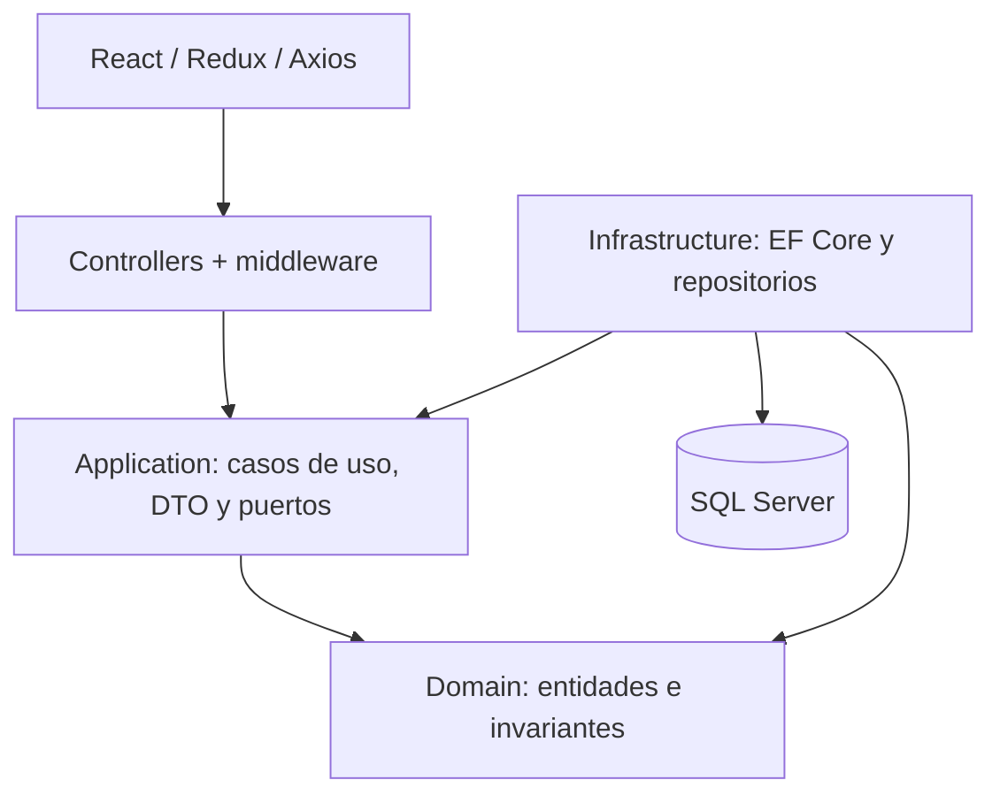
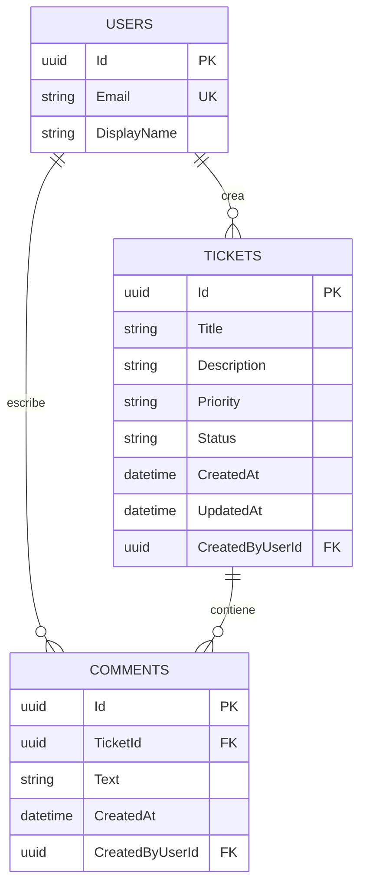
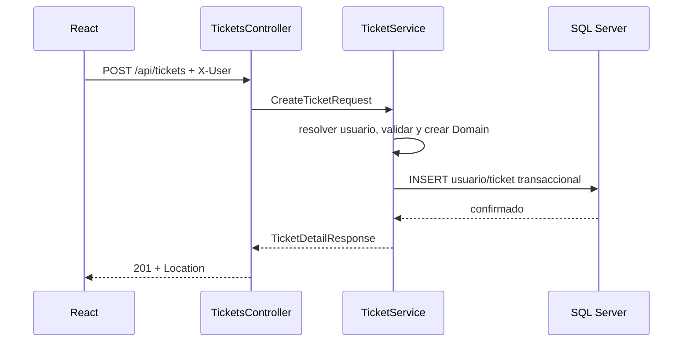

# Arquitectura de SupportDesk

## Contexto

## Contenedores y capas

Domain no referencia frameworks ni capas exteriores. Api compone dependencias; Infrastructure implementa los puertos definidos en Application.

## Modelo de datos

## Flujo de creación

## Flujo de estado

El controller entrega el estado solicitado a Application. Domain calcula el único siguiente estado permitido; un salto produce `BusinessConflictException`, traducido a 409. Una transición válida actualiza `UpdatedAt` UTC, persiste y se registra con ticket/estado sin body sensible.

## Operación

La API acepta/genera `X-Correlation-ID` y lo devuelve. En producción se propone consolidar logs/métricas/trazas, usar health checks de DB, alertar por latencia/errores y proteger Swagger. Backups, restauración y rollback deben ensayarse según el hosting real.
