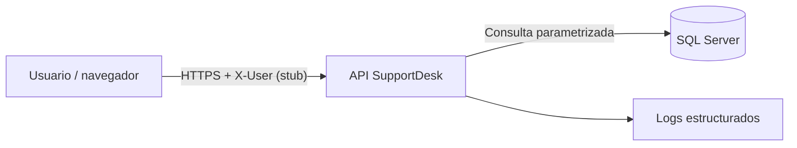

# Threat model — SupportDesk

## Alcance y activos

El análisis cubre el cliente React, API .NET, SQL Server, configuración local, dependencias, logs, Swagger y el encabezado `X-User`. Los activos son tickets, comentarios, identidad básica, trazabilidad y disponibilidad del servicio.

## Límites de confianza

Todo dato del navegador se considera no confiable. `X-User` es manipulable y sirve solo para el examen local; no representa autenticación.

## Amenazas y mitigaciones

| Amenaza | Impacto | Mitigación actual | Pendiente productivo |
|---|---|---|---|
| Overposting | Cambio de campos internos | DTO específicos | Pruebas de contrato adicionales |
| Inyección SQL | Lectura/modificación de datos | EF Core y parámetros | SAST/DAST en CI |
| XSS almacenado | Ejecución en navegador | React codifica texto; no hay HTML arbitrario | CSP estricta |
| Suplantación con `X-User` | Operaciones como otro usuario | Riesgo explícito y servicio encapsulado | OIDC/JWT obligatorio |
| Abuso de paginación | Consumo de recursos | `pageSize` máximo 100 y `q` máximo 200 | Rate limiting por identidad |
| Transiciones inválidas | Corrupción del flujo | Regla en Domain y 409 | Auditoría persistente |
| Enumeración por GUID | Descubrimiento de recursos | GUID y errores uniformes | Autorización por alcance/propiedad |
| Errores internos | Fuga de información | Problem Details seguro | Alertas centralizadas |
| CORS permisivo | Acceso desde origen no deseado | Allowlist por configuración | Revisión por ambiente |
| Secretos versionados | Compromiso de DB | `.env` ignorado y ejemplo ficticio | Gestor de secretos |
| Logs sensibles | Exposición de contenido | No se registran bodies | Redacción centralizada |
| Dependencias vulnerables | Ejecución de código | Versiones fijadas y auditoría CI | Política de actualización |

## Limitaciones

No se ejecutaron ataques, DAST, escaneo de red ni pruebas sobre terceros. El modelo no certifica seguridad ni cumplimiento legal.
